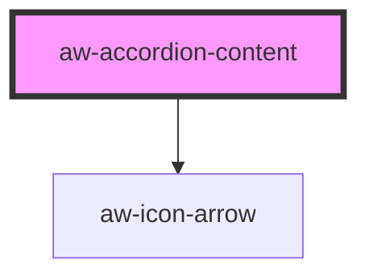

# aw-accordion-content

<!-- Auto Generated Below -->

## Properties

| Property   | Attribute   | Description | Type      | Default     |
| ---------- | ----------- | ----------- | --------- | ----------- |
| `isOpened` | `is-opened` |             | `boolean` | `false`     |
| `name`     | `name`      |             | `string`  | `undefined` |
| `title`    | `title`     |             | `string`  | `undefined` |

## Events

| Event                        | Description | Type                  |
| ---------------------------- | ----------- | --------------------- |
| `awOnAccordionContentToggle` |             | `CustomEvent<string>` |

## Dependencies

### Depends on

- [aw-icon-arrow](../icons/aw-icon-arrow)

### Graph

----------------------------------------------

*Built with [StencilJS](https://stenciljs.com/)*
