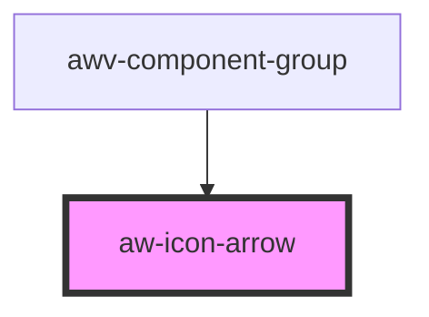

# aw-icon-arrow

<!-- Auto Generated Below -->

## Properties

| Property       | Attribute       | Description | Type                                               | Default   |
| -------------- | --------------- | ----------- | -------------------------------------------------- | --------- |
| `color`        | `color`         |             | `string`                                           | `'#000'`  |
| `direction`    | `direction`     |             | `"down" \| "inverse" \| "left" \| "right" \| "up"` | `'down'`  |
| `noTransition` | `no-transition` |             | `boolean`                                          | `false`   |
| `size`         | `size`          |             | `"huge" \| "large" \| "medium" \| "small"`         | `'small'` |

## Dependencies

### Used by

 - [awv-component-group](../../../showroom/awv-component-group)

### Graph

----------------------------------------------

*Built with [StencilJS](https://stenciljs.com/)*
